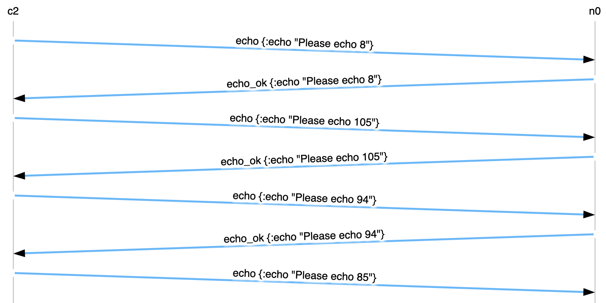

# Echo!

Цель данной задачи - познакомить вас с системой тестирования курса.

1. Прочитайте [спецификацию](../../maelstrom/doc/protocol.md) протокола maelstrom.
2. Ознакомьтесь с [echo workload](../../maelstrom/doc/workloads.md).
3. Напишите программу, которая на запрос типа `echo` отвечает сообщением типа `echo_ok`.
4. Протестируете вашу программу с помощью `make run TASK=echo PROG_LANG=<ваш яп> PROFILE=1`.
   В случае корректного решения вы должны увидеть в конце вывода jepsen: ``Everything looks good! ヽ(‘ー`)ノ``.
5. Ознакомьтесь с [результатами тестирования](../../maelstrom/doc/results.md). Уделите особое внимание логам jepsen (jepsen.log) и логам узлов вашего кластера (папка node-logs).

В конце `jepsen.log` можно ознакомиться с суммарной статистикой по исполнению:

```clj
2025-07-22 06:27:24,438{GMT}	INFO	[jepsen test runner] jepsen.core: {:perf {:latency-graph {:valid? true},
        :rate-graph {:valid? true},
        :valid? true},
 :timeline {:valid? true},
 :exceptions {:valid? true},
 :stats {:valid? true,
         :count 28,
         :ok-count 28,
         :fail-count 0,
         :info-count 0,
         :by-f {:echo {:valid? true,
                       :count 28,
                       :ok-count 28,
                       :fail-count 0,
                       :info-count 0}}},
 :availability {:valid? true, :ok-fraction 1.0},
 :net {:all {:send-count 58,
             :recv-count 58,
             :msg-count 58,
             :msgs-per-op 2.0714285},
       :clients {:send-count 58, :recv-count 58, :msg-count 58},
       :servers {:send-count 0,
                 :recv-count 0,
                 :msg-count 0,
                 :msgs-per-op 0.0},
       :valid? true},
 :workload {:valid? true, :errors ()},
 :valid? true}


Everything looks good! ヽ(‘ー`)ノ
```

Часто для понимания цельной картины исполнения нельзя обойтись без визуализаций. Maelstrom в качестве одного из артифактов своего исполнения создаёт svg файл, в котором располагается пространственно-временная диаграмма запросов между узлами. Каждой вертикальной временной линии соответствует узел системы: это или клиент (название начинается с `c`), или узел кластера, экземпляр вашей программы (название начинается с `n`).

Пример диаграммы:



6. Создайте ветку `task/echo/<ваш яп>/1`, поместите в неё решение задачи и вызовите `make submit`, в открывшемся окне введите ваши группу и ФИО.
7. Перейдите в репозиторий от которого вы делали форк и удостовертесь, что на ваше имя создан pr.
